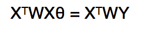
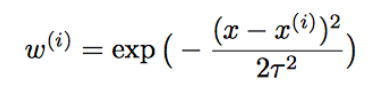
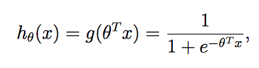
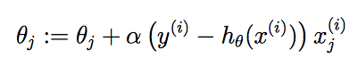
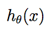
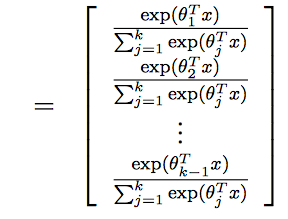
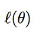
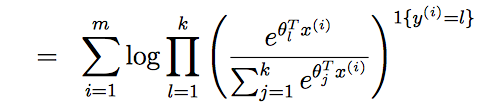

# Regression-models
Various regression models including logistic, linear and softmax regressors

## Sections 
+ [Overview](https://github.com/vipul-khatana/Regression-models#overview)
+ [Principles used](https://github.com/vipul-khatana/Regression-models#principles-used)
+ [Libraries](https://github.com/vipul-khatana/Regression-models#installation)
+ [How to run](https://github.com/vipul-khatana/Regression-models#how-to-run)
+ [Author](https://github.com/vipul-khatana/Regression-models#author)
+ [Contributing](https://github.com/vipul-khatana/Regression-models#contributing)

## Overview
The basic objective of the code is to provide various regression models, which can be used for supervised learning. Linear regression is applied to predict the house prices. A modified version of the linear regression, locally weighted linear regression is also implemented. Conditions under which we may over fit or under fit the data are also observed with the various plots. Gaussian Discriminant Analysis and Logistic Regression are the basic methods used for binary classification while softmax regressor finds its use in multi class classification. A brief explanation of these models are given below. 

## Principles used: 

+ **Linear Regression** - Linear regression is an approach for modelling the relationship between a scalar dependent variable Y and one or more independent variable X. In case of a single variable we call it simple linear regression, while in the case of multiple variables it is called as multivariate linear regression. Linear regression assumes that the relation between the input vector x and the output label y is linear, and we calculate the error between the predicted and the actual value. Then using the Gradient descent algorithm we update the values of the slope of the line that we assume. We keep on updating the parameters until their value converges. 

+ **Locally weighted Linear Regression** - A locally weighted linear regressor fits the curve better when the relation between teh input vector and the output vector is not linear. Instead of fitting a single regression line we try to fit multiple such line and the final curve obtained is sort of a product of all these lines. For any point x we try to find points closest to x which can fit our model. The equation for locally weighted linear regression is given below 

where w is given by 

+ **Logistic Regression** - Logistic Regression is one of the most basic methods used for binary classification. Given a set of data points, this method constructs a hyperplane which separates the two sets of points. The hypothesis function for logit regression is given by 

Using the gradient descent algorithm we update the value of the parameter theta after every iteration. 

+ **Softmax Regression** - Since the Logistic Regression mentioned above can only be used for binary classification, in this part I try to implement the softmax regressor which can also be used for multi-class classification. The hypothesis function is given by 

We maximise the log likelihood by using the gradient descent. The equation for the log-likelihood is given below. 

+ **Gaussian Discriminant Analysis** - Gaussian discriminant analysis is a method of data classification generally used when data can be approximated with a normal distribution. Using the training set we first of all train a classifier, and then obtain a discriminant function which tells us the class to which a data point has higher probability of belonging to. Then we calculate the mean and standard deviation, two parameters that define a normal distribution, for the data set. Once we have computed the normal distribution for each class, we calcualte the probability of the point belonging to a class and draw the decision boundary. 

## Libraries 
Following libraries are required along with python : 
numpy, matplotlib, mpl_toolkits.mplot3d, pandas. 

These libraries can be installed by using the pip installer 

If you have pip installed on your system then use `pip install library_name` to install the required library. 
If you do not have pip then please look [here](https://pip.pypa.io/en/stable/installing/) on how to install pip

## How to run 
Please include the training and test data sets in a .csv format. 
The format for the name of the training data should be `train_data_filename.csv` 
For training labels it should be `train_label_filename.csv`
For testing data it should be `test_data_filename.csv`

In the command line type `python filename.py`
This will output the results as  `result_filename.csv`
where filename is
+ linear_reg for linear regression
+ linear_reg_wtd for locally weighted linear regression
+ logistic_reg for logistic regression
+ GDA for Gaussian discriminant analysis
+ Softmax for Softmax regression

## Author 

* [Vipul Khatana](https://github.com/vipul-khatana)

Course project under [**Prof. Jayadeva**](http://jayadeva.net) 

## Contributing

1) Fork it (https://github.com/vipul-khatana/Regression-models/fork)
2) Create your feature branch `git checkout -b feature/fooBar`
3) Commit your changes `git commit -am 'Add some fooBar'`
4) Push to the branch `git push origin feature/fooBar`
5) Create a new pull request 
